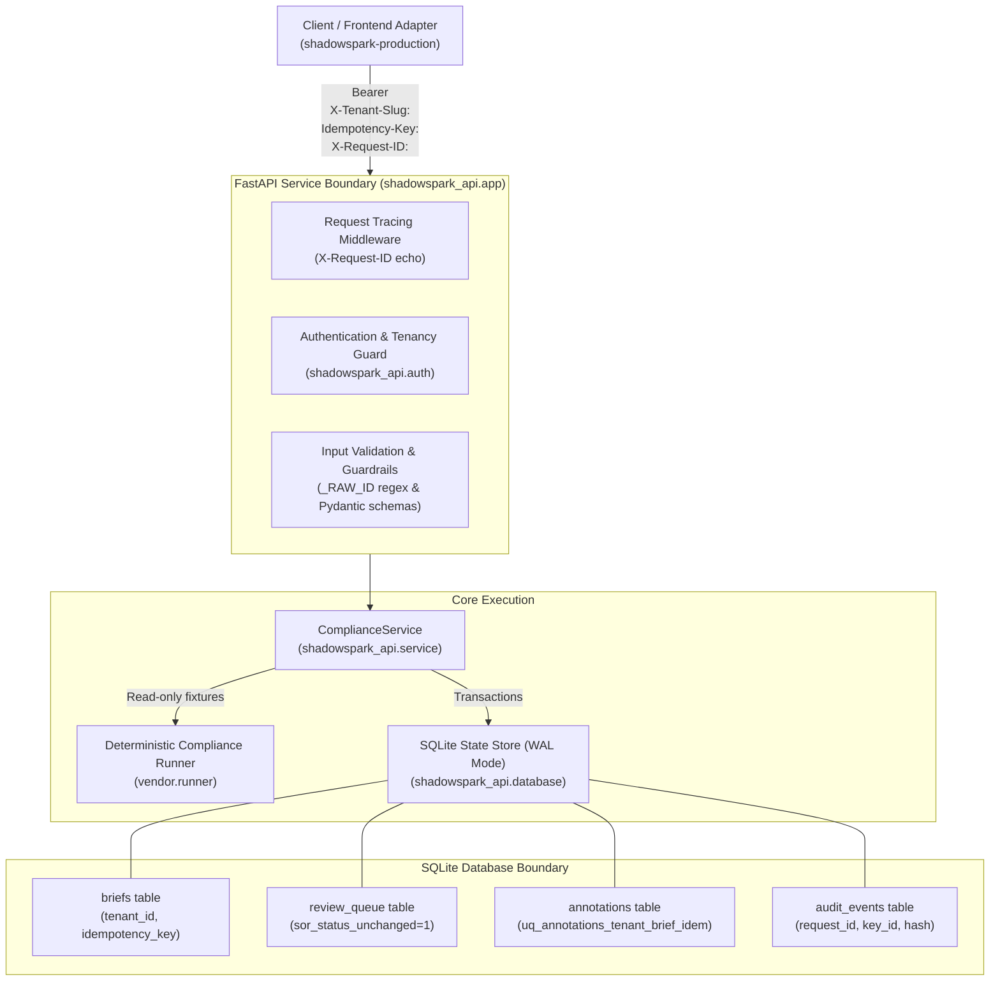

# ShadowSpark AI-ASSIST — Architecture Specification

## 1. System Overview & Boundaries

`AI-ASSIST` is an isolated, multi-tenant compliance review and brief generation engine. It processes exception records and generates deterministic compliance briefs for human operators, managing a review queue and immutable operator audit annotations.

---

## 2. Core Architectural Principles

### 2.1 Zero-Trust Multi-Tenancy (Fail-Closed)
- **Tenant Context**: All resources (briefs, review queues, annotations, idempotency records, audit events) are strictly scoped to a tenant identity (`tenant_id`).
- **Header Parsing**: Tenant identity is supplied via `X-Tenant-Slug` or `X-Tenant-ID`. Value must match `^[a-z0-9][a-z0-9_-]{0,63}$`.
- **Mismatches**: If a caller provides both an explicit `tenant_id` in the JSON request body and a tenant header, the values must strictly match; otherwise, the request is rejected with `400 Bad Request`.
- **Production Fail-Closed Invariant**: In production (`SHADOWSPARK_ENV=production`), omitting or passing an empty tenant header raises `AuthenticationError("tenant identifier required in production")` (`401 Unauthorized`).
- **Cross-Tenant Isolation**: Requesting an exception or brief belonging to another tenant yields `404 Not Found`, denying existence and preventing tenant enumeration.

### 2.2 Immutability of External Systems of Record (SoR)
- The review queue records `sor_status_unchanged INTEGER NOT NULL CHECK(sor_status_unchanged=1)`.
- The AI-ASSIST engine never performs mutations against upstream banking or compliance systems of record. Annotations appended by operators are strictly audit overlays.

### 2.3 Idempotency Engine
- Mutating endpoints (`POST /v1/compliance-review-brief` and `POST /v1/review-queue/{brief_id}/annotations`) strictly mandate an `Idempotency-Key` header (1 to 128 characters).
- **Request Fingerprinting**: The payload is serialized with deterministic JSON (`sort_keys=True, separators=(',', ':')`) and hashed using SHA-256:
  $$\text{request\_hash} = \text{SHA256}(\text{canonical\_json}(\text{payload}))$$
- **Replay Semantics**:
  - If the `(tenant_id, idempotency_key)` tuple already exists and `request_hash` matches, the stored brief/review is returned with `replayed: true` (HTTP 201 or 200).
  - If the `(tenant_id, idempotency_key)` tuple exists but `request_hash` differs, the request is rejected with `409 Conflict` (`idempotency key conflict`).
- **Annotation Idempotency**:
  - Enforced via unique composite index `uq_annotations_tenant_brief_idem` on `(tenant_id, brief_id, idempotency_key)`.
  - Re-issuing an annotation with the same idempotency key and text returns the current review object without duplicate entries. Mismatched text raises `409 Conflict`.

### 2.4 Persistence & Concurrency Strategy
- **Engine**: Embedded SQLite 3.
- **Journal Mode**: WAL mode (`PRAGMA journal_mode=WAL`).
- **Foreign Keys**: Enabled (`PRAGMA foreign_keys=ON`).
- **Busy Timeout**: 5000 milliseconds (`PRAGMA busy_timeout=5000`).
- **Transaction Isolation**: Write operations use `BEGIN IMMEDIATE` to obtain an exclusive write lock up front, preventing `SQLITE_BUSY` deadlock cascades.
- **Process Model**: Single Uvicorn worker process (`--workers 1`) and single container instance to guarantee SQLite write-lock serialization.
- **Storage Mounting**: Persistent disk mounted at `SHADOWSPARK_DB_PATH` ensures durability across container redeployments and restarts.

### 2.5 Audit Logging & Tracing
- **Tracing**: Middleware extracts `X-Request-ID` or generates a UUIDv4 hex string, attaching it to `request.state.request_id` and echoing it on every response header.
- **Credential Protection**:
  - Raw Bearer tokens are NEVER stored in plaintext or logged.
  - In production, key fingerprints are derived via `token:<sha256(token)[:12]>`.
- **Data Protection Guardrails**:
  - `_RAW_ID` regex rejects raw 11-digit national identity numbers (BVN/NIN) in request bodies (`422 Unprocessable Entity`).
  - Pre-persistence check `_safe()` prevents raw identity numbers or `Bearer ` substrings from ever being written to SQLite.
